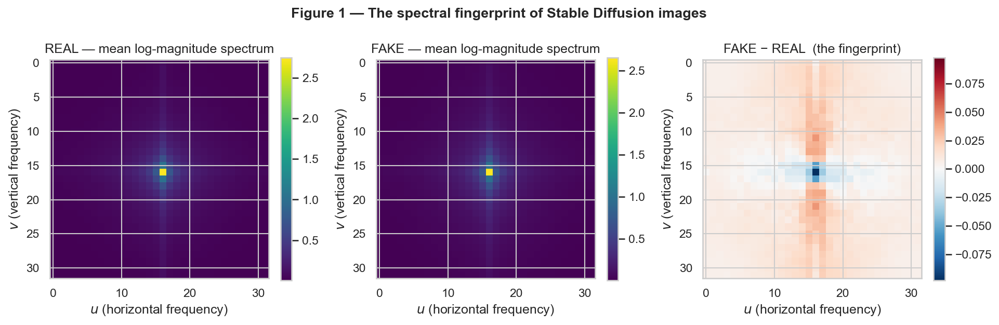
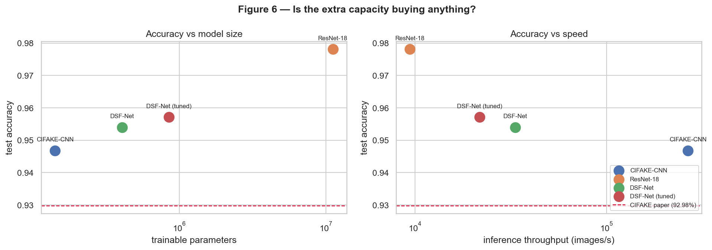
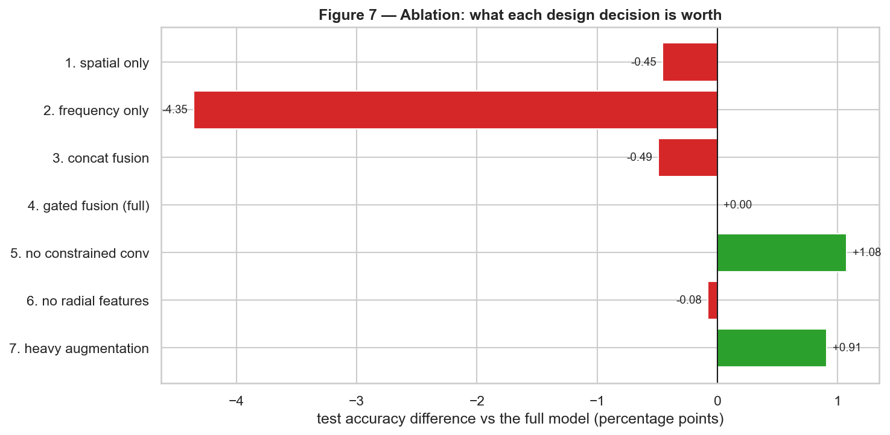
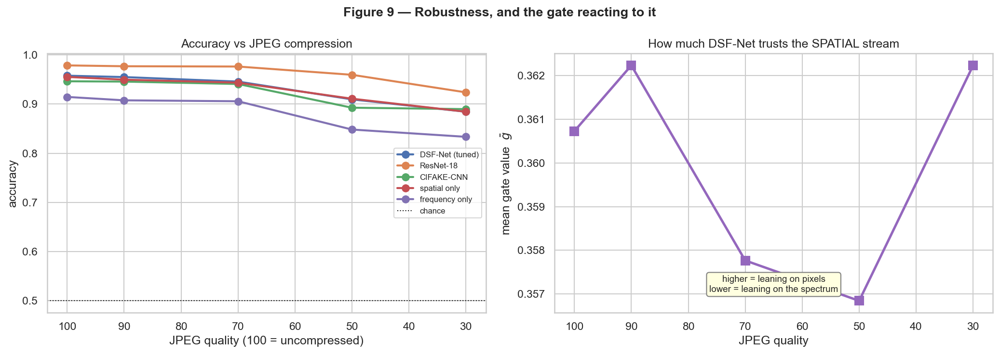
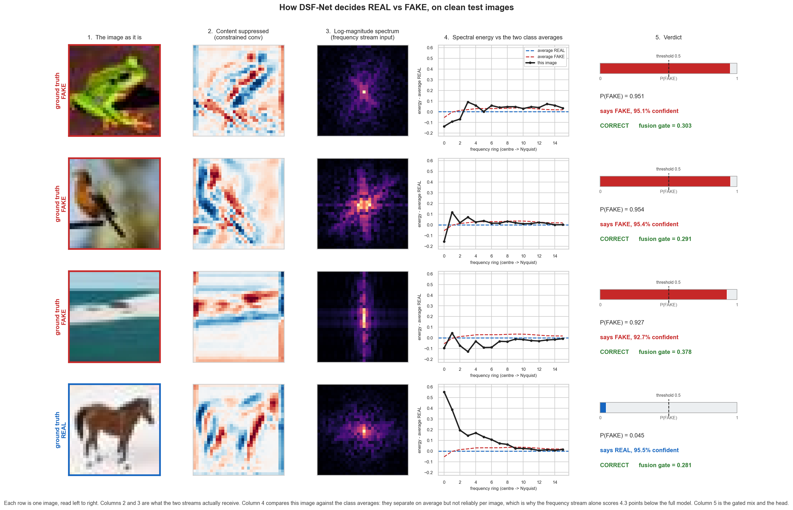

# DSF-Net - Spectral-Spatial Detection of AI-Generated Images

**A dual-stream neural network that detects Stable-Diffusion images by reading the generator
fingerprint in the Fourier spectrum, plus an honest account of the three design hypotheses that
turned out to be wrong.**


By **Nihat Garibli**.

| | |
| --- | --- |
| Runnable notebook | [`notebooks/AIGID_main.ipynb`](notebooks/AIGID_main.ipynb) |
| Model and training code | [`src/`](src/) |
| Analysis and figure scripts | [`tools/`](tools/) |
| Numbers behind every claim | [`results/`](results/) |

---

## The idea in one paragraph

Detecting AI-generated images is a forensic problem, not a semantic one: a fake photo of a dog and a
real photo of a dog contain the same dog, so the object category carries no signal. What does carry
signal is the periodic, high-frequency artefact left behind by the generator's upsampling stack:
faint in pixel space, structurally obvious in the 2D Fourier spectrum. **DSF-Net** processes each
image through two parallel streams (a *spatial* stream fronted by a constrained high-pass filter
that suppresses image content, and a *frequency* stream operating on the log-magnitude spectrum plus
its radial profile) and fuses them with a **learned per-dimension gate** intended to decide, per
image, how much to trust each view.

That was the hypothesis. The evidence mostly refuted it; see **Results** below. The study was run
twice end to end, which is what makes the refutation credible.

### The signal the model is built on

Averaged over 10,000 images per class, before any model is trained:



Real photographs have a smooth, roughly power-law spectrum. Stable Diffusion leaves a structured
high-frequency residue. That difference is the entire basis of the architecture.

## Architecture

```text
                    input 32x32x3  (augmented, normalised)
                                |
         +----------------------+----------------------+
         |                                             |
   SPATIAL STREAM                              FREQUENCY STREAM
   ConstrainedConv2d 5x5 (Bayar-Stamm)         fft2 -> fftshift -> log(1+|F|)
   centre = -1, other weights sum to 1                  |
         |                                    +---------+----------+
   stem Conv3x3 -> BN -> SiLU                 |                    |
   ResBlock  32ch @32x32                 SpecCNN (GroupNorm)  radial profile
   ResBlock  64ch @16x16                 3 convs, 32->64ch    16 bins -> MLP
   ResBlock 128ch @8x8                        |                    |
         |                                  GAP 64-d            32-d
    GAP -> z_s (128-d)                         +--------+---------+
         |                                          z_f (96-d)
         +-------------------> GATED FUSION <------------+
                    g = sigmoid(W [z_s ; z_f] + b)     (128-d gate)
                    z = g * P_s(z_s) + (1 - g) * P_f(z_f)
                                |
            LayerNorm -> Dropout -> Linear(128->64) -> SiLU -> Linear(64->1)
```

848,066 parameters at the tuned width of 1.5.

## Results

Test set, 20,000 images, positive class = FAKE. From [`results/metrics.csv`](results/metrics.csv).

| Model | Accuracy | ROC-AUC | ECE | Params | img/s |
| --- | ---: | ---: | ---: | ---: | ---: |
| Spectral-LogReg (no deep learning) | 0.7846 | 0.8610 | 0.0335 | 17 | - |
| CIFAKE-CNN (paper reimplementation) | 0.9468 | 0.9885 | 0.0580 | 141,345 | 266,511 |
| **DSF-Net (tuned)** | **0.9571** | 0.9910 | **0.0392** | 848,066 | 21,699 |
| ResNet-18 (fine-tuned) | **0.9781** | **0.9964** | 0.0458 | 11,169,345 | 9,393 |

DSF-Net beats the **published CIFAKE reference (92.98%) by 2.73 points** with 13.2x fewer parameters
and 2.3x the throughput of ResNet-18, and is the best-calibrated model tested. **It loses to
ResNet-18 by 2.10 points**, which the report states plainly rather than working around.



### What replicated, and what did not

The entire study was run twice from scratch. That is what makes the table below meaningful:

| Finding | Run 1 | Run 2 | Replicates? |
| --- | ---: | ---: | --- |
| Frequency stream alone is much weaker | -4.23 pp | -4.35 pp | **yes** |
| Removing the constrained conv **helps** | +0.90 pp | +1.08 pp | **yes** |
| Heavy augmentation **helps** | +0.90 pp | +0.91 pp | **yes** |
| Gated fusion beats concatenation | +0.02 pp | -0.49 pp | **no, sign flip** |
| Gate shifts under JPEG compression | -0.0060 | +0.0015 | **no, refuted** |

Three of the project's own design arguments were wrong, and the central claim, that gating beats
concatenation, **does not replicate**. A single run would have shown gating winning by half a point
and looked entirely convincing. The seed sweep in [`tools/seed_sweep.py`](tools/seed_sweep.py)
and the tables in [`results/`](results/) are where that is measured, including a structural
reason the gate could never have been interpretable as built.



The measured run-to-run noise floor is **0.08 pp**, which is what every bar above has to be judged
against. Two of the seven ablation effects survive that test.

### What did work

**JPEG augmentation**: +4.82 pp at quality 30 at no cost on clean images. That variant beats
ResNet-18 under heavy compression (93.26% vs 92.38%).



## Repository layout

```text
notebooks/
  AIGID_main.py                     <- master copy of the notebook, jupytext "percent" format
  AIGID_main.ipynb                  <- generated notebook; the deliverable to run and submit
  AIGID_main.executed.backup.ipynb  <- run 1, preserved; the replication table depends on it
tools/
  demo.py                           <- live demo: trained model, real test images, seconds
  seed_sweep.py                     <- retrains every ablation across N seeds, with paired tests
  try_image.py                      <- run the model on any image, and show why the answer is not evidence
  py2ipynb.py                       <- rebuilds the .ipynb from the .py
  smoke_test.py                     <- runs the model/training code on synthetic data, no dataset needed
  pipeline_test.py                  <- runs EVERY notebook cell end to end on synthetic data
  run_notebook.py                   <- headless execution helper
results/                            <- metrics.csv, ablations.csv, robustness.csv, tuning.csv,
                                       digest.txt, run1_digest.txt, figures/
run.log, run2.log                   <- console logs of the two full study runs
checkpoints/                        <- saved weights, written during training (not in git)
data/                               <- cached dataset arrays (not in git)
```

Model weights (about 340 MB) and the cached dataset (about 330 MB) are deliberately **not** in this
repository. Both are regenerated by running the notebook.

## Running it

### Live demo, no training (`tools/demo.py`)

If the checkpoints and the dataset cache are already on disk, this classifies real held-out
test images in front of you in about three seconds:

```bash
python tools/demo.py                # 8 random test images + full test-set score
python tools/demo.py -n 12 --seed 7 # a different sample
python tools/demo.py --jpeg 30      # same, but JPEG-compressed to quality 30 first
python tools/demo.py --smooth       # interpolate the 32x32 photos for a cleaner slide
```

```text
       #  truth  predicted  confidence    gate   verdict
    4735  FAKE   FAKE           95.3%   0.304   correct
   17383  REAL   REAL           95.3%   0.449   correct
   11643  REAL   FAKE           94.8%   0.336   WRONG
    ...
  7/8 correct on this sample, decided in 662 ms

scoring the full test set (20,000 images, clean) ...
  accuracy: 0.9571   (95.71%)
  computed in 2.4s
  report's headline figure: 0.9571   |   CIFAKE paper reference: 0.9298
  mean gate over the whole test set: 0.3607
```

The demo recomputes the headline 95.71% live rather than quoting it, prints the fusion gate
per image so the flat-gate result from Section 7.3 of the report is visible as it happens,
and with `--jpeg 30` degrades the whole test set to reproduce the 88.4% robustness number
from `results/robustness.csv`.

It also writes a figure that walks one image at a time through the whole decision:



Left to right: the image itself, what survives the constrained convolution once content is
suppressed, the log-magnitude spectrum the frequency stream reads, this image's radial
energy against the two class averages, and the probability that comes out. Note that the
photos are 32x32 because that is the dataset's resolution; `--smooth` interpolates them for
display without changing anything the model sees. Note that the
radial profiles separate the classes *on average* but not reliably per image, which is the
visual form of the ablation result that the frequency stream alone is 4.3 points weaker
than the full model.

### Google Colab (the intended path)

1. Upload `notebooks/AIGID_main.ipynb` to Colab, or open it from Drive.
2. `Runtime -> Change runtime type -> T4 GPU`.
3. **First**, set `QUICK_RUN = True` in Section 2.2 and `Run all`. This executes the entire
   notebook (every figure, every ablation, every robustness condition) on a subsample with
   2-epoch training runs, in a few minutes. It proves the pipeline works before you commit to
   the full run. The numbers it produces are meaningless; that is the point.
4. Then set `QUICK_RUN = False` and `Run all` again for the real results.

The notebook mounts Google Drive and writes everything to `MyDrive/dl_final_aigid/`. That matters:
checkpoints are **resumable**, so if a Colab session is reclaimed mid-training, re-running the cell
picks up from the last completed epoch instead of starting over.

First run decodes 120,000 images (a few minutes) and caches them as `uint8` arrays; every later
session loads in seconds.

### Locally

The notebook detects that it is not on Colab and adjusts paths and worker counts automatically:

```bash
pip install -r requirements.txt
jupyter lab notebooks/AIGID_main.ipynb
```

Reference timing: about 90 minutes for one full end-to-end study on an RTX 5070 Laptop (8 GB).

### After editing the notebook source

The `.py` file is the master copy; edit that, then regenerate:

```bash
python tools/py2ipynb.py notebooks/AIGID_main.py notebooks/AIGID_main.ipynb
```

### Verifying the code without the dataset

`tools/smoke_test.py` extracts every cell tagged `# @smoke` from the notebook source, runs it, and
exercises the models on synthetic images containing a *planted* Nyquist-frequency artefact. If
DSF-Net finds the planted artefact, the FFT path, the constrained front-end, the gate, AMP and the
training loop are all correctly wired.

```bash
python tools/smoke_test.py
```

`tools/pipeline_test.py` goes further: it runs **every** notebook cell (EDA, all three
baselines, the hyperparameter sweep, all seven ablations, the ten-condition robustness sweep,
Grad-CAM, t-SNE, calibration and error analysis) against a synthetic stand-in for CIFAKE with
`QUICK_RUN` forced on, and checks that all result files and figures were actually produced.
This is the "does Run All work" check.

```bash
python tools/pipeline_test.py
```

## Dataset

**CIFAKE**: 60k real CIFAR-10 photographs vs 60k Stable Diffusion v1.4 images, 32x32 RGB, canonical
100k/20k train/test split, CC BY-NC 4.0.

Loaded from the Hugging Face Hub (no API token needed):

```python
load_dataset("dragonintelligence/CIFAKE-image-dataset")
```

A commented-out Kaggle fallback (`birdy654/cifake-real-and-ai-generated-synthetic-images`) is
included in the notebook in case the mirror moves.

A stratified 10% validation set is carved from the training portion. **All** tuning decisions use
validation only; the test set is read once, in Section 13.

## What the notebook produces

| Section | Output |
| --- | --- |
| 4 | The spectral fingerprint figure, which motivates the architecture |
| 7-9 | Three baselines: classical spectral classifier, the CIFAKE paper's CNN, ResNet-18 |
| 10 | DSF-Net, with layer-by-layer justification |
| 12 | Coordinate-descent hyperparameter search over lr, dropout, width |
| 13 | Test-set comparison table, ROC curves, accuracy-vs-cost plots |
| 14 | Seven-way ablation isolating each design decision |
| 15 | Robustness under JPEG / blur / noise / rescaling, plus the gate-response plot |
| 16 | Grad-CAM, t-SNE, gate distributions, calibration |
| 17 | Error analysis on the most confident mistakes |
| 18 | Auto-generated results digest -> `results/digest.txt` |

All 16 generated figures are in [`results/figures/`](results/figures/).

## Reproducibility

- Seed 42 throughout; `seed_everything` is called before every training run.
- Hardware used: NVIDIA RTX 5070 Laptop (8 GB), PyTorch 2.x + CUDA. The notebook runs unchanged on a
  Colab T4.
- Every number in the report and in this README traces to a CSV in `results/`.
- `results/run1_digest.txt` preserves the first run; `results/digest.txt` is the second. The
  replication table above is the comparison of the two.

## Reference

Bird, J. J., & Lotfi, A. (2024). *CIFAKE: Image Classification and Explainable Identification of
AI-Generated Synthetic Images.* IEEE Access, 12, 15642-15650. Reports **92.98%** accuracy on this
dataset, the reference number the notebook compares against.

Full reference list in the notebook's final section.

## License

Code in this repository is released under the [MIT License](LICENSE). The CIFAKE dataset itself is
**CC BY-NC 4.0** and is not redistributed here; it is downloaded from the Hugging Face Hub at
runtime, and its licence terms apply to any use of the data.
